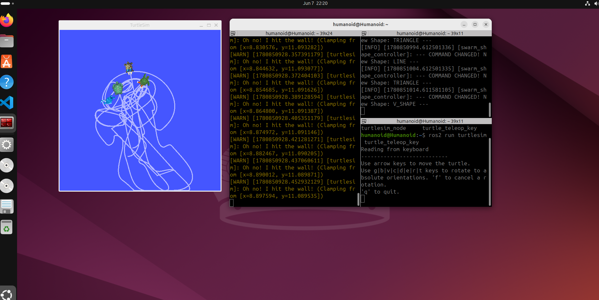

# 🐢 Swarm Robotics in ROS2 – Dynamic Formation Control

This project demonstrates a **swarm robotics system** using ROS2 and Turtlesim, where multiple agents coordinate to maintain dynamic formations while following a leader.

---

## 🚀 Overview

The system consists of:

* 🟢 **1 Leader Turtle** (manually controlled)
* 🔵 **3 Follower Turtles**
* 🧠 A ROS2 node implementing swarm behavior

Followers continuously adjust their positions relative to the leader, forming structured patterns such as:

* Line Formation
* Triangle Formation
* V-Shape Formation

The formation automatically changes every **10 seconds**, showcasing adaptive multi-agent coordination.

---

## 🎥 Demo



---

## 🧠 Key Concepts

This project applies fundamental robotics and control principles:

* 📐 Coordinate transformations (local → global frame)
* 🔄 Rotation matrices
* 📏 Euclidean distance calculation
* 🧭 Angle normalization
* 🎯 Proportional Control (P-Controller)
* 🤖 Multi-agent (swarm) coordination

---

## ⚙️ How It Works

### 1. Formation Definition

Each formation is defined using relative offsets from the leader:

```python
self.shapes = {
    'LINE': {
        'turtle2': (-1.0, 0.0),
        'turtle3': (-2.0, 0.0),
        'turtle4': (-3.0, 0.0)
    },
    ...
}
```

---

### 2. Coordinate Transformation

Follower targets are computed using a rotation transformation:

$x_{target} = x_{leader} + (x_{offset} \cos\theta - y_{offset} \sin\theta)$

$y_{target} = y_{leader} + (x_{offset} \sin\theta + y_{offset} \cos\theta)$


This ensures the formation rotates naturally with the leader.

---

### 3. Control Strategy (P-Controller)

Each follower computes:

* Distance to target
* Angular error

Control laws:
$v = k_d \cdot d$

$\omega = k_\theta \cdot \theta_{error}$

This results in smooth and responsive motion.

---

### 4. Dynamic Formation Switching

Formations change automatically every 10 seconds:

```python
self.create_timer(10.0, self.change_shape_loop)
```

---

## 🛠️ Installation & Setup

### Prerequisites

* ROS2 (Humble / Foxy recommended)
* turtlesim package

### Run the Simulation

```bash
# Start turtlesim
ros2 run turtlesim turtlesim_node

# Run swarm controller
ros2 run <your_package_name> swarm_controller
```

---

## 📂 Project Structure

```
swarm-robotics-ros2/
│── swarm_controller.py
│── README.md
│── images/
```

---

## 🌟 Features

* Dynamic formation switching
* Orientation-aware movement
* Smooth motion using proportional control
* Modular and extensible design

---

## 🚀 Future Improvements

* Obstacle avoidance
* Decentralized swarm behavior
* Flocking algorithms (Boids: separation, alignment, cohesion)
* Scaling to larger swarms

---

---
